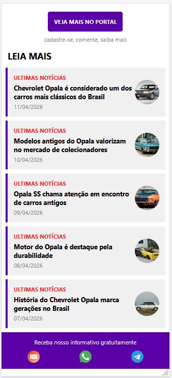

<h1 align="center">Desafio 04 - App de Notícias - Chevrolet Opala</h1>

<p align="center">
  <a href="#-atividade">Atividade</a>&nbsp;&nbsp;&nbsp;|&nbsp;&nbsp;&nbsp;
  <a href="#descrição-do-projeto">Descrição do Projeto</a>&nbsp;&nbsp;&nbsp;|&nbsp;&nbsp;&nbsp;
  <a href="#estrutura-do-projeto">Estrutura do Projeto</a>&nbsp;&nbsp;&nbsp;|&nbsp;&nbsp;&nbsp;
  <a href="#-tecnologias">Tecnologias</a>&nbsp;&nbsp;&nbsp;|&nbsp;&nbsp;&nbsp;
  <a href="#-layout-do-app">Layout do App</a>&nbsp;&nbsp;&nbsp;|&nbsp;&nbsp;&nbsp;
  <a href="#exemplo-de-uso">Exemplo de Uso</a>&nbsp;&nbsp;&nbsp;|&nbsp;&nbsp;&nbsp;
  <a href="#-feito-por">Feito por</a>
</p>

<br>

<a href="https://github.com/Ncgrande">
  
</a>

---

## ✅ Atividade

<p align="justify">
Desenvolvimento de um aplicativo mobile utilizando React Native, com o objetivo de exibir uma lista de notícias sobre o Chevrolet Opala, aplicando conceitos de componentização e uso de arrays.
</p>

---

## 📋 Descrição do Projeto

- Aplicativo de notícias com tema **Chevrolet Opala**
- Exibição de 5 notícias armazenadas em array
- Cada notícia contém:
  - Manchete
  - Data
  - Imagem ilustrativa
- Uso de **componentização**
- Interface inspirada em portais de notícia

### Funcionalidades da interface:
- Botão de destaque "VEJA MAIS NO PORTAL"
- Lista de notícias estilizada
- Barra lateral colorida
- Imagens ao lado direito
- Rodapé com ícones de contato

---

## 📂 Estrutura do Projeto


```
├── App.js # Componente principal da aplicação
├── print.png # Print do projeto
├── README.md # Documentação do projeto
```

---

## 🚀 Tecnologias

- React Native
- Expo
- JavaScript
- Node.js

---

## 📱 Layout do App

<p align="center">
  
</p>


---

## 💻 Exemplo de Uso

1. Instalar as dependências:
```
npm install
```

2. Iniciar o projeto:

```
npx expo start
```

3. Executar no celular:
- Baixe o app **Expo Go**
- Escaneie o QR Code exibido no terminal

---

## 👽 Feito por

Estudante do 4º semestre de Análise e Desenvolvimento de Sistemas:

- **Nilson Grande**
